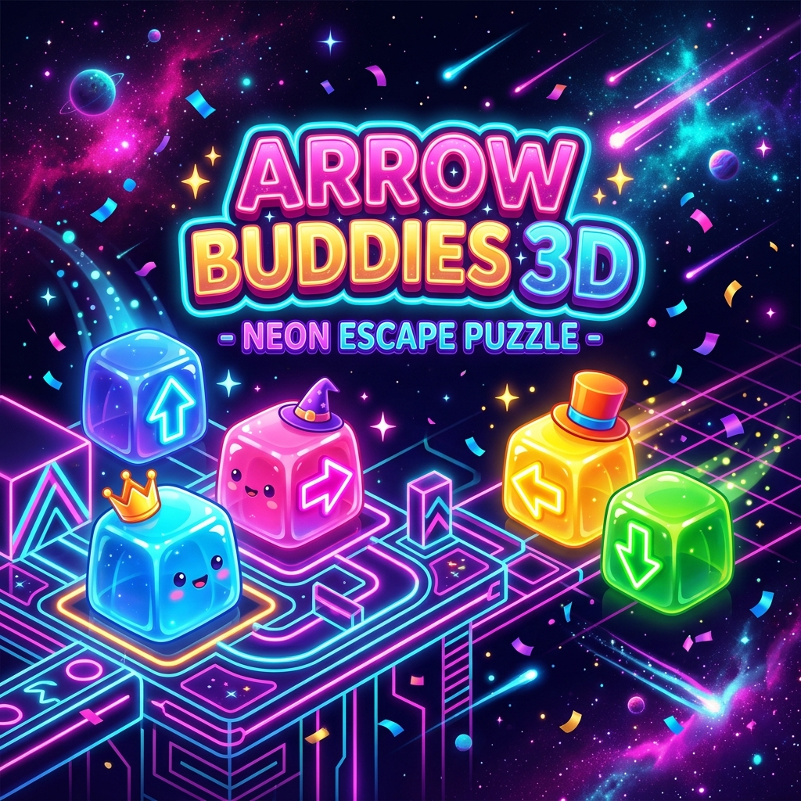
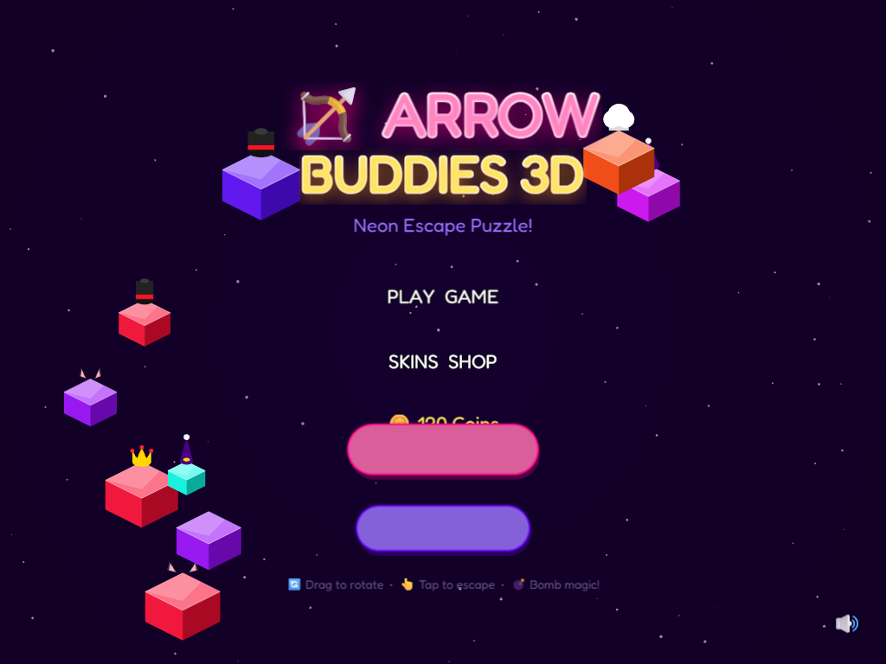
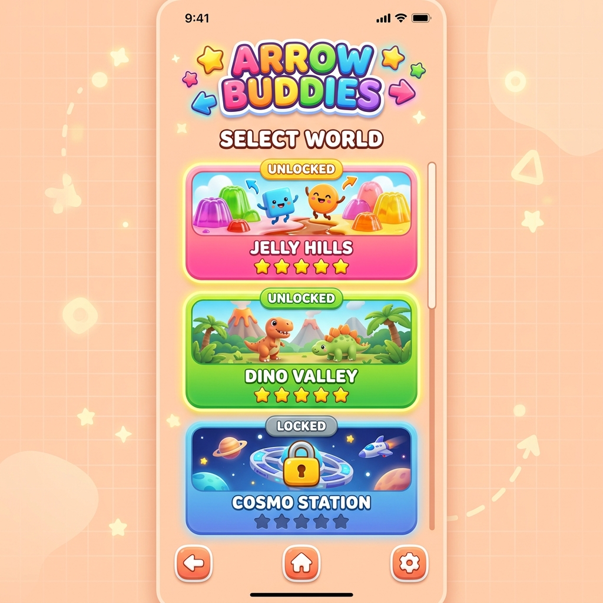

# 🏹 Arrow Buddies 3D — Мила Головоломка-Втеча!

<p align="center">
  
</p>

<p align="center">
  <strong>🌟 Неонова 3D головоломка для дітей і дорослих! 🌟</strong><br/>
  Грай прямо в браузері — на телефоні, планшеті чи комп'ютері!
</p>

---

## 📸 Скріншоти гри

<table>
  <tr>
    <td align="center">
      <br/>
      <em>🏠 Головне меню</em>
    </td>
    <td align="center">
      <br/>
      <em>🌍 Вибір Світу</em>
    </td>
  </tr>
</table>

---

## 🎮 Як грати?

Привіт, друже! Ласкаво просимо до **Arrow Buddies 3D** — найкрутішої та найяскравішої 3D гри-головоломки! Твої маленькі блочні друзі загубилися у великому світі і не можуть вибратися. На кожному з них намальована стрілочка, яка показує напрямок, куди вони хочуть стрибнути. Твоя мета — допомогти їм втекти!

1. 👆 **Тапай (клікай) по блоку**, щоб він полетів у свій бік!
2. 🔍 **Шукай вільний шлях** — блок летить тільки якщо перед ним немає інших
3. 🌀 **Крути камеру** пальцем або мишкою, щоб знайти приховані шляхи
4. ⭐ **Очисти весь рівень** — виграй і збери зірки!

> 💡 **Підказка:** Якщо блок вдариться об іншого, він залишиться на місці — думай наперед!

---

## 🎁 Спеціальні блоки

| Блок | Назва | Що робить |
|------|-------|-----------|
| 🌈 | **Веселковий** | Летить куди завгодно, якщо шлях вільний! |
| 💣 | **Бомба** | Вибухає і знищує всі блоки на шляху! |
| 🔑 | **Ключ** | Використовуй, щоб відкрити Скриню |
| 🧰 | **Скриня** | Потребує Ключа — без нього не зникне |

---

## 🌍 Світи

### 🌸 Jelly Hills — Желейні Пагорби
> Легкий старт! Милі рожеві та пурпурні кольори, прості фігури. Ідеально для початківців!

### 🦕 Dino Valley — Долина Динозаврів
> Зелені джунглі! З'являються бомби та ключі. Треба думати на кілька ходів вперед!

### 🚀 Cosmo Station — Космічна Станція
> Темний космос з яскравим неоном! Мега-головоломки з величезними структурами — тільки для справжніх героїв!

---

## 👕 Магазин Скінів

Заробляй монетки 🪙 під час гри і купуй круті 3D капелюхи для своїх блочних друзів!

| Капелюх | Назва |
|---------|-------|
| 🧙‍♂️ | Чарівний Ковпак |
| 👑 | Золота Корона з Рубінами |
| 🐱 | Котячі Вушка |
| 🎩 | Елегантний Циліндр |
| 👨‍🍳 | Шапка Шеф-кухаря |
| 🌈 | Веселковий Ореол |
| 🚁 | Кепка з Пропелером (крутиться!) |

---

## 🛠️ Технічний стек

| Технологія | Призначення |
|-----------|-------------|
| **Phaser 3** | Ігровий рушій (сцени, фізика, частинки) |
| **TypeScript** | Основна мова програмування |
| **Vite** | Збирач та dev-сервер |
| **Isometric Rendering** | Власний рушій ізометричної 3D графіки |

---

## 🚀 Як запустити?

```bash
# Встановити залежності
npm install

# Запустити в режимі розробки
npm run dev

# Зібрати для продакшн
npm run build
```

Відкрий браузер на **http://localhost:5173/**

---

## 🗺️ Наступні кроки розробки (Roadmap)

### 🔴 Пріоритет 1 — Критичне (Short-term)
- [ ] **Звукові ефекти** — Більше різноманітних звуків (спеціальні звуки для бомб, корони, ключів)
- [ ] **Анімація перемоги** — Покращена анімація зірок та конфетті на екрані Victory
- [ ] **Збереження прогресу** — Зберігати відкриті рівні та зірки між сесіями (localStorage)
- [ ] **Оптимізація мобільного вводу** — Покращення чутливості тапу та свайпу на телефонах

### 🟡 Пріоритет 2 — Нові функції (Mid-term)
- [ ] **Більше Світів (4, 5, 6)** — Підводний Світ 🐠, Замок Льоду ❄️, Вулканічна Земля 🌋
- [ ] **Нові типи блоків**:
  - 🪞 **Дзеркало** — відбиває напрям сусідніх блоків
  - 🧲 **Магніт** — притягує сусідні блоки перед польотом
  - ⏱️ **Таймер** — блок вибухає через 3 ходи!
- [ ] **Множник Комбо** — Ланцюгові реакції дають +2x, +3x монети
- [ ] **Дейлі Челленджі** — Щоденне завдання з унікальною нагородою
- [ ] **Таблиця Рекордів** — Топ 10 гравців за кожним рівнем

### 🟢 Пріоритет 3 — Розширення (Long-term)
- [ ] **Мультиплеєр** — Грати проти друга в режимі "хто швидше очистить рівень"
- [ ] **Редактор Рівнів** — Створюй власні головоломки та ділись з друзями
- [ ] **Система Досягнень** — Значки за особливі успіхи (наприклад, "Майстер Комбо")
- [ ] **Анімовані Персонажі** — Блоки з мімікою: радіють, засмучуються, сміються
- [ ] **PWA / Офлайн режим** — Гра без інтернету як застосунок
- [ ] **App Store / Google Play** — Публікація як нативний мобільний додаток

---

## 👨‍💻 Внесок

Гра розроблена з ❤️ для юних гравців 7-11 років. Будь-які пропозиції та pull requests вітаються!

**Бажаємо тобі успіхів, юний герою! 🎉**
