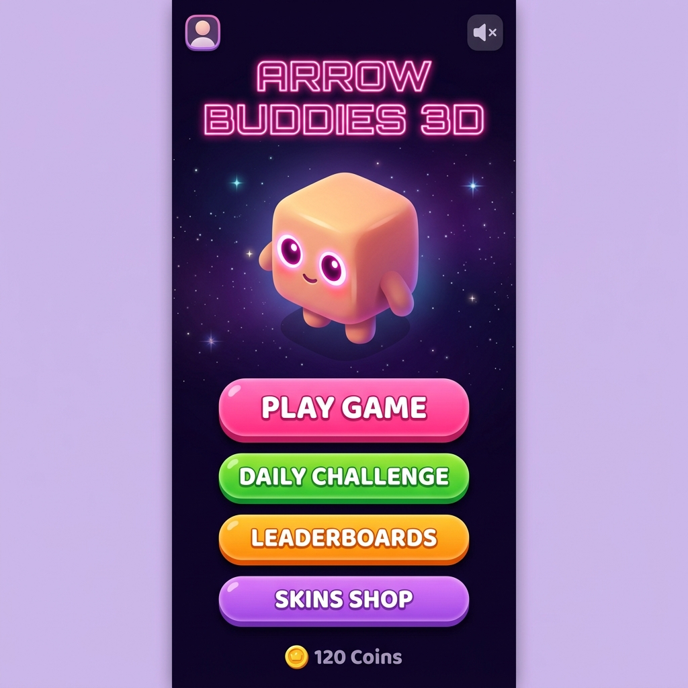

# 🏹 Arrow Buddies 3D — Мила Головоломка-Втеча!

<p align="center">
  
</p>

<p align="center">
  <strong>🌟 Неонова ізометрична 3D головоломка для дітей і дорослих! 🌟</strong><br/>
  Грай прямо в браузері — на телефоні, планшеті чи комп'ютері!
</p>

<p align="center">
  
  
  
  
  
</p>

---

## 📸 Скріншоти гри

<table>
  <tr>
    <td align="center">
      <br/>
      <em>🏠 Головне меню</em>
    </td>
    <td align="center">
      <br/>
      <em>🎮 Геймплей (Ізометрична 3D сітка)</em>
    </td>
  </tr>
  <tr>
    <td align="center">
      <br/>
      <em>🌍 Вибір Світу</em>
    </td>
    <td align="center">
      <br/>
      <em>🛍️ Магазин скінів (Гача)</em>
    </td>
  </tr>
</table>

---

## 🎮 Як грати?

Привіт, друже! Ласкаво просимо до **Arrow Buddies 3D** — найкрутішої ізометричної 3D гри-головоломки! Твої маленькі блочні друзі загубилися у великому 3D світі. На кожному блоці намальована стрілочка — це напрямок куди він хоче стрибнути. Твоя мета — допомогти їм вибратися!

1. 👆 **Тапай по блоку** — він летить у напрямку своєї стрілочки
2. 🔍 **Шукай вільний шлях** — блок летить лише якщо попереду нікого немає
3. 🌀 **Крути камеру** свайпом або мишкою, щоб знайти приховані виходи
4. ⭐ **Очисти весь рівень** — виграй і збери зірки!
5. 🔥 **Вибивай комбо** — виштовхуй кілька блоків поспіль і отримуй бонусні монети!

> 💡 **Підказка:** Якщо блок вдариться об іншого — він залишиться на місці. Думай наперед і будуй ланцюгові реакції!

---

## 🧩 Типи блоків

| Іконка | Назва | Поведінка |
|--------|-------|-----------|
| 🟣 | **Звичайний** | Летить у напрямку своєї стрілочки |
| 🌈 | **Веселковий** | Може летіти у будь-який вільний бік |
| 💣 | **Бомба** | Вибухає і знищує всі сусідні блоки |
| 🔑 | **Ключ** | Відкриває Скриню потрібного кольору |
| 🧰 | **Скриня** | Заблокована — зникне лише після ключа |
| 🔄 | **Ротатор** | Повертає напрямок сусідніх блоків на 90° |
| 🌀 | **Портал** | Телепортує блоки між двома точками |

---

## 🌍 Шість Світів

| # | Назва | Матеріал | BGM Тема | Складність |
|---|-------|----------|----------|------------|
| 1 | 🍬 **Jelly Hills** | Желейний силікон | 138 BPM · C-major · sine | ⭐ |
| 2 | 🦕 **Dino Valley** | Деревина | 110 BPM · G-minor · triangle | ⭐⭐ |
| 3 | 🚀 **Cosmo Station** | Метал / Залізо | 132 BPM · D-minor · sawtooth | ⭐⭐⭐ |
| 4 | 🐠 **Coral Reef** | Вода | 100 BPM · F-major · sine | ⭐⭐⭐ |
| 5 | ❄️ **Ice Castle** | Крига | 92 BPM · A-minor · crystalline | ⭐⭐⭐⭐ |
| 6 | 🌋 **Volcanic Land** | Обсидіан/Магма | 158 BPM · E-minor · sawtooth | ⭐⭐⭐⭐⭐ |

Кожен світ має унікальні **звукові ефекти** (окрема тембральна характеристика польоту та удару), власну **колірну палітру** та **тему BGM** з трьома шарами (бас · мелодія · арпеджіо).

---

## 🎵 Аудіо-система

Arrow Buddies 3D використовує **повністю процедурний** аудіо-рушій без жодного аудіо-файлу:

**BGM (Howler.js):**
- 7 унікальних тем (меню + 6 світів), синтезованих через `OfflineAudioContext` у WAV-буфери
- Три незалежні шари: *бас* · *мелодія* · *арпеджіо*
- **Крос-фейд** між темами за 600 мс при переході між сценами
- **Динамічна інтенсивність** — арпеджіо шар автоматично вмикається при комбо ≥ 3 та вимикається на спокійних ділянках

**SFX (Web Audio API — нульова затримка):**
- Матеріальні звуки польоту та удару (окремо для кожного з 6 світів)
- Комбо-фанфара з 4 рівнями (x2 → x3 → x4 → x5+), тон підвищується з кожним рівнем
- Джингли перемоги: 1★ / 2★ / 3★ варіанти
- Мелодія поразки, старту рівня, ключа, відкриття скрині, екіпіювання скіну

---

## 👕 Магазин Скінів (Гача)

Заробляй монетки 🪙 під час гри та крути **гача-машину** за капелюхи для блоків!

| Іконка | Назва | Рідкість |
|--------|-------|---------|
| 😊 | Без капелюха | Common |
| 🧙 | Чарівний ковпак | Rare |
| 👑 | Корона | Epic |
| 🐱 | Котячі вушка | Common |
| 🎩 | Циліндр | Rare |
| 👨‍🍳 | Шапка шеф-кухаря | Common |
| 🚁 | Пропелер (крутиться!) | Epic |
| 🌈 | Веселковий ореол | Legendary |
| 🐉 | Голова Дракона | Legendary |
| 👑✨ | Золота Трофейна Корона | Legendary |

**Розблокування:** гача-спін (50🪙), безкоштовний спін за рекламу, стрік щоденних завдань.

---

## 📅 Щоденні Виклики

Щодня — новий унікальний рівень з підвищеною нагородою. Граємо 7 днів поспіль → отримуємо **ексклюзивний скін**:
- Стрік **5 днів** → 👑✨ Золота Трофейна Корона
- Стрік **7 днів** → 🐉 Голова Дракона

---

## 🏆 Таблиця Лідерів

Онлайн-рейтинг на основі:

```
Рахунок = Монети × 10 + Досвід + Зірки × 150
```

Синхронізація відбувається автоматично після кожного виграного рівня.

---

## 👤 Профіль Гравця

- Ім'я користувача та аватар-емодзі
- **Рівень XP** — `floor((XP / 100) ^ (1/1.4)) + 1`
- Система звань: Novice Archer → Puzzle Seeker → Combo Wizard → ... → Mythic Arrow God 🌌
- Статистика: рекорд, вирішені головоломки, серія перемог, загальні зірки

---

## 🛠️ Технічний стек

| Технологія | Призначення | Версія |
|-----------|-------------|--------|
| **Phaser 4** | Ігровий рушій (WebGL, сцени, частинки) | 4.2 |
| **TypeScript** | Основна мова програмування | 5.x |
| **Vite** | Збирач та dev-сервер | 8.x |
| **Howler.js** | BGM-менеджер (шари, iOS unlock, fade, loop) | 2.x |
| **GSAP** | UI анімації (spring, morph, stagger) | 3.15 |
| **canvas-confetti** | Confetti на перемозі та гачі | 1.9 |
| **Custom IsoEngine** | Ізометричний 3D рушій (`IsoHelper.ts`) | — |
| **OfflineAudioContext** | Процедурна BGM генерація в WAV-буфери | Web API |

---

## 🗂️ Архітектура проекту

```
src/
├── main.ts                  # Phaser Game init, реєстрація сцен
├── audio.ts                 # AudioManager: BGM (Howler) + SFX (Web Audio)
├── skins.ts                 # SKIN_LIST — метадані скінів
├── levelGenerator.ts        # Процедурна генерація рівнів (back-solving)
├── style.css                # Глобальні стилі: no-scroll, no-select, scrollbar
├── scenes/
│   ├── BootScene.ts         # Preload + генерація програмних текстур
│   ├── MenuScene.ts         # Головне меню, анімований 3D-баді, навігація
│   ├── WorldSelectScene.ts  # Вибір світу (6 карток + зірки + замки)
│   ├── LevelSelectScene.ts  # Вибір рівня 1–5 по кожному світу
│   ├── GameScene.ts         # Основний ігровий цикл (~2000 рядків)
│   │   ├── Ізометрична 3D сітка + jelly limbs, squash & stretch
│   │   ├── Система ходів та комбо
│   │   ├── Частинки (шатер, конфеті, портал, unlock)
│   │   └── Динамічна погода / фонові ефекти
│   ├── VictoryScene.ts      # Перемога: зірки, XP, нагороди, лідерборд
│   ├── DefeatScene.ts       # Поразка: реклама за бонусні ходи
│   ├── ShopScene.ts         # Гача-магазин + гардероб скінів
│   ├── DailyChallengeScene.ts # Щоденний виклик + стрік
│   ├── LeaderboardScene.ts  # Онлайн таблиця лідерів
│   └── ProfileScene.ts      # Профіль гравця + досягнення
└── utils/
    ├── IsoHelper.ts         # Ізо-математика, рендер кубів, кнопки, фон
    ├── GameData.ts          # localStorage wrapper (монети, прогрес, скіни)
    ├── AdManager.ts         # Адаптер реклами (CrazyGames / Poki / Mock)
    └── LeaderboardService.ts # Онлайн рейтинг (sync + cache)
```

---

## 🚀 Як запустити?

```bash
# Встановити залежності
npm install

# Запустити в режимі розробки
npm run dev
# → http://localhost:5173/

# Зібрати для продакшн
npm run build

# Попередній перегляд продакшн збірки
npm run preview
```

---

## 🗺️ Roadmap

### ✅ Вже реалізовано
- [x] Ізометрична 3D графіка (власний рушій без Three.js)
- [x] 6 унікальних світів з матеріальними SFX та BGM темами
- [x] 7 типів блоків (normal, bomb, key, chest, rainbow, rotator, portal)
- [x] Система комбо з візуальним та звуковим зворотнім зв'язком
- [x] Гача-магазин з 10 скінами (Common → Legendary)
- [x] Щоденні виклики + серія стріків (5-ти та 7-ми денних нагород)
- [x] Онлайн таблиця лідерів
- [x] Профіль гравця з XP, рівнями та системою звань
- [x] Динамічна процедурна музика (Howler.js + 7 BGM тем, 3 шари кожна)
- [x] Комбо-фанфара, джингли зірок, звук поразки, старту рівня
- [x] Повна підтримка iOS Safari (AudioContext unlock)
- [x] Адаптивний UI (телефон, планшет, ПК)
- [x] Haptic feedback на мобільних

### 🔜 Найближчі плани
- [ ] **PWA** — офлайн режим + "Додати на главний екран"
- [ ] **Редактор рівнів** — створюй власні головоломки та ділись з друзями
- [ ] **Мультиплеєр** — змагання в реальному часі
- [ ] **Система досягнень** — значки за особливі успіхи
- [ ] **App Store / Google Play** (Capacitor або React Native)

---

## 👨‍💻 Внесок

Гра розроблена з ❤️. Будь-які пропозиції та pull requests вітаються!

```bash
# Перевірка типів
npx tsc --noEmit

# Збірка
npm run build
```

**Бажаємо тобі успіхів, юний герою! 🎉**