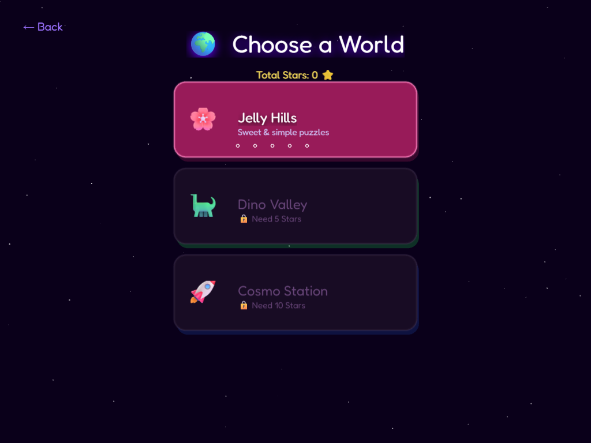

# 🏹 Arrow Buddies 3D — Neon Escape Puzzle

<p align="center">
  
</p>

<p align="center">
  <strong>🌟 Реалістична 3D головоломка на Babylon.js — для мобільних і ПК! 🌟</strong><br/>
  Грай прямо в браузері — на телефоні, планшеті чи комп'ютері
</p>

<p align="center">
  
  
  
  
</p>

---

## 📸 Скріншоти

<table>
  <tr>
    <td align="center">
      
      <br/><em>🏠 Головне меню</em>
    </td>
    <td align="center">
      
      <br/><em>🌍 Вибір Світу</em>
    </td>
    <td align="center">
      
      <br/><em>🎮 Геймплей</em>
    </td>
  </tr>
</table>

---

## 🎮 Як грати?

Твої блочні друзі — Arrow Buddies — хочуть вибратися зі своїх позицій! Кожен несе стрілку, що показує напрямок, куди він хоче полетіти. Допоможи їм!

| Дія | Опис |
|-----|------|
| 👆 **Тап** | Торкнись блока, щоб він полетів у свій напрямок |
| 🌀 **Свайп** | Проведи пальцем горизонтально, щоб повернути камеру |
| 🤌 **Щипок** | Зведи / розведи пальці для зуму |
| 🖱️ **ПКМ / Колесо** | Зум мишкою на ПК |

> 💡 **Стратегія:** Блок може вилетіти, лише якщо шлях перед ним повністю вільний. Думай наперед!

---

## 🎁 Спеціальні блоки

| Іконка | Назва | Дія |
|--------|-------|-----|
| 🌈 | **Веселковий** | Обирає **будь-який** вільний напрямок сам |
| 💣 | **Бомба** | Вибухає та знищує сусідні блоки |
| 🔑 | **Ключ** | Відкриває прив'язану Скриню |
| 🧰 | **Скриня** | Заблокована — потрібен Ключ |
| 🌀 | **Ротатор** | Змінює напрямки сусідніх блоків на 90° |
| 🔮 | **Портал** | Телепортує блоки між двома порталами |

---

## 🌍 Світи

| Світ | Назва | Особливість | Потрібно ⭐ |
|------|-------|-------------|------------|
| 🌸 | **Jelly Hills** | Прості форми, пастельні кольори | 0 |
| 🦕 | **Dino Valley** | Бомби, Ключі, Скрині | 5 |
| 🚀 | **Cosmo Station** | Портали, Веселкові | 10 |
| 🐠 | **Coral Reef** | Ротатори, складні структури | 15 |
| ❄️ | **Ice Castle** | Ланцюгові реакції | 22 |
| 🌋 | **Volcanic Land** | Магма, максимальний рівень складності | 30 |

---

## 👕 Магазин Скінів

Заробляй 🪙 монети й купуй ексклюзивні 3D капелюхи для своїх блоків!

| Капелюх | Назва | Ціна |
|---------|-------|------|
| 🧙‍♂️ | Магічний Ковпак | 80 🪙 |
| 👑 | Золота Корона | 150 🪙 |
| 🐱 | Котячі Вушка | 60 🪙 |
| 🎩 | Циліндр | 100 🪙 |
| 🚁 | Кепка з Пропелером | 200 🪙 |
| 🐉 | Корона Дракона | Стрік 7 днів |

---

## 🛠️ Технічний стек

| Технологія | Версія | Призначення |
|-----------|--------|-------------|
| **Babylon.js** | 9.x | 3D рушій, PBR-матеріали, пост-ефекти |
| **@babylonjs/gui** | 9.x | Інтерфейс (GUI поверх 3D) |
| **TypeScript** | 6.x | Типізація та архітектура |
| **Vite** | 8.x | Збирач та dev-сервер |
| **Custom IsoEngine** | – | Ізометрична проєкція для 2D fallback |

### 🚀 Оптимізації продуктивності

- **Мобільні пристрої:** HardwareScaling 0.75×, без SSAO, без DOF, тіні 512px
- **ПК:** Повний PBR + SSAO (8 семплів) + DOF + Bloom + MSAA 4×
- **Рушій**: Єдина Babylon.js сцена, SceneManager для переходів
- **GUI**: Глобальний `AdvancedDynamicTexture` — без дублювання шарів

---

## 🚀 Як запустити?

```bash
# Встановити залежності
npm install

# Dev-сервер (з hot reload)
npm run dev

# Production збірка
npm run build
```

Відкрий [`http://localhost:5173`](http://localhost:5173) після `npm run dev`.

---

## 📁 Структура проєкту

```
src/
├── babylon/          # Babylon.js engine wrappers
│   ├── BabylonEngine.ts       # Engine init + render loop
│   ├── BabylonBackground.ts   # Camera, lights, post-FX
│   ├── BabylonBlockScene.ts   # 3D block mesh sync
│   ├── BabylonGUI.ts          # GUI texture manager
│   ├── BabylonParticles.ts    # Weather & VFX particles
│   ├── SceneManager.ts        # Scene lifecycle
│   ├── TweenManager.ts        # Animation system
│   ├── HUD.ts                 # In-game HUD
│   └── PhaserMock.ts          # Compatibility shim
├── scenes/           # All game scenes
│   ├── BootScene.ts           # Splash / loading
│   ├── MenuScene.ts           # Main menu ✨
│   ├── WorldSelectScene.ts    # World picker
│   ├── LevelSelectScene.ts    # Level list
│   ├── GameScene.ts           # Core gameplay (2000+ LoC)
│   ├── VictoryScene.ts        # Win screen
│   ├── DefeatScene.ts         # Game over
│   ├── LeaderboardScene.ts    # Rankings
│   ├── ShopScene.ts           # Skins
│   └── DailyChallengeScene.ts # Daily mode
├── utils/
│   ├── GameData.ts            # Persistent localStorage saves
│   ├── LeaderboardService.ts  # Cloud leaderboard
│   └── IsoHelper.ts           # Isometric math & drawing
├── levelGenerator.ts          # Procedural level builder
└── audio.ts                   # Sound manager
```

---

## 📱 Мобільна підтримка

Гра оптимізована для мобільних пристроїв:
- ✅ Touch-first controls (tap, swipe, pinch-zoom)
- ✅ Haptic feedback (вібрація при подіях)
- ✅ `100dvh` viewport (iOS safe area)
- ✅ `touch-action: none` (без скролу браузера)
- ✅ Адаптивне масштабування UI

---

<p align="center">
  Made with ❤️ and Babylon.js 3D magic<br/>
  <sub>© 2025 Arrow Buddies 3D</sub>
</p>
